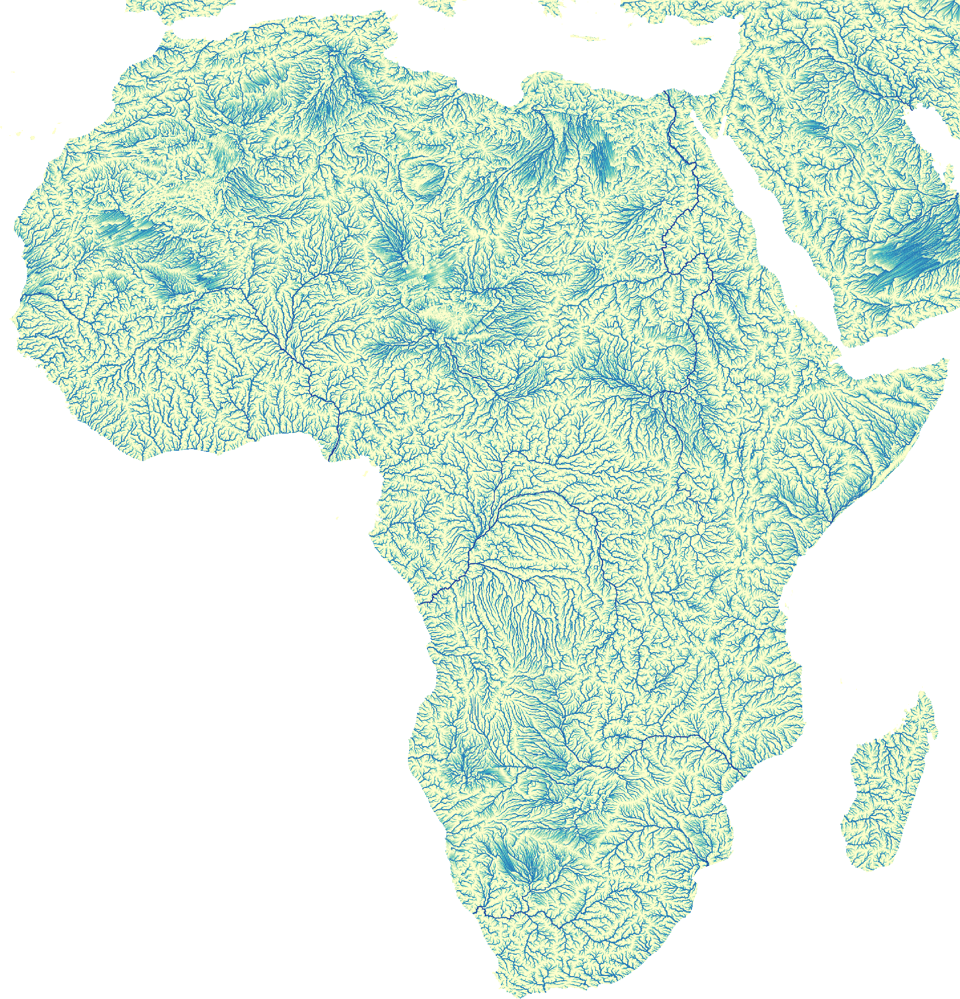

# paper_2021_routing

This repository contains a version of the LUE environmental modelling framework as used
in our 2021 manuscript, as well as example scripts and other files used in the preparation of
that manuscript. We try to provide all information needed for others to be able to rerun
experiments and reproduce results on similar platforms, but it is unlikely that the scripts in
this repository will work unchanged. Feel free to contact the corresponding author [Kor de
Jong](mailto:k.dejong1@uu.nl) in case you have questions.

- De Jong, K., Panja, D., Karssenberg, D., Van Kreveld, M., Scalability and composability
  of flow accumulation algorithms based on asynchronous many-tasks (submitted for review)

| directory              | contents                                                                       |
| ---------              | --------                                                                       |
| `lue`                  | Version of LUE described in manuscript                                         |
| `lue/benchmark`        | Settings and scripts related to scalability experiments performed              |
| `lue/source/framework` | Modelling framework source code                                                |
| `output`               | Outputs of scaling experiments performed                                       |
| `source`               | Various scripts related to performance and composability experiments performed |

[The](The) most recent LUE source code can be found in LUE's
[own repository](https://github.com/computationalgeography/lue).

In the sources, flow accumulation algorithms are named as in the manuscript, but with a postfix
of '3'. So `accu_threhold` is called `accu_threshold3`. The algorithms we describe are the 3rd
version of several trials.

[](document/figure/README.md)


## Create paper environment and build LUE modelling framework
LUE is currently developed and tested on Linux using GCC-9/10. Whenever LUE is changed, it is
built for various platforms (combinations of operating systems, versions of 3rd party libraries
and tools). For this Github workflows are used that use Github actions. Inspecting
[the Github workflow scripts](lue/.github/workflows)
can be useful to configure a platform on which LUE can be built. LUE potentially compiles and
runs fine on other platforms too, but this is not regularly tested.

Here is an example session of building the version of LUE used for our manuscript:

```bash
cd /tmp
# Recursive is used to also checkout submodules
git clone --recurse-submodules https://github.com/computationalgeography/paper_2021_routing
cd paper_2021_routing
conda env create -f environment/configuration/conda_environment.yml
conda activate paper_2021_routing
mkdir build
cd build
cmake \
    -DCMAKE_BUILD_TYPE=Release \
    -DCMAKE_TOOLCHAIN_FILE=$PROJECTS/my_devenv/configuration/platform/cmake/login01/Release.cmake \
    -DLUE_BUILD_DATA_MODEL:BOOL=TRUE \
    -DLUE_DATA_MODEL_WITH_PYTHON_API:BOOL=TRUE \
    -DLUE_DATA_MODEL_WITH_UTILITIES:BOOL=TRUE \
    -DLUE_BUILD_HPX:BOOL=TRUE \
    -DLUE_BUILD_FRAMEWORK:BOOL=TRUE \
    -DLUE_DATA_MODEL_WITH_PYTHON_API:BOOL=TRUE \
    -DLUE_FRAMEWORK_WITH_PYTHON_API:BOOL=TRUE \
    -DLUE_HAVE_DOCOPT:BOOL=FALSE \
    -DLUE_HAVE_FMT:BOOL=FALSE \
    -DLUE_HAVE_NLOHMANN_JSON:BOOL=FALSE \
    -DLUE_HAVE_PYBIND11:BOOL=FALSE \
    ../lue
cmake --build . --parallel 10
```

The mentioned CMake toolchain file contains additional settings specific for the
platform we used for running the experiments. It is part of the author's [my_devenv
repository](https://github.com/kordejong/my_devenv/tree/9eb8896d24389f5ae9090d368dd2fac88259c633)
containing files that are useful in multiple research and development projects.

The LUE framework source code depends on 3rd party libraries and tools, that may or may not
be installed already on your system. Dependencies can usually be installed using
your system's package manager, using [Conan](https://conan.io), or using
[Conda](https://conda.io). See the Github workflow scripts for examples of platforms that are
guaranteed to work.

Other versions of these packages than the ones mentioned in the Github workflow scripts might
also work. HPX is built during the LUE build.

More information about building (the latest version of) LUE can be found in [the LUE
documentation](https://lue.computationalgeography.org/doc).

Once LUE is built, executables can be found in `build/bin` and shared libraries and Python
packages in `build/lib`. On Linux, the software can be used like this:

```bash
cd build

# Use a LUE executable
bin/lue_translate --help

# Use the LUE Python package
PYTHONPATH=`pwd`/lib:$PYTHONPATH python -c "import lue; print(lue.__version__)"
```

Note that LUE is still experimental software. The above has been tested on the platform we
performed our experiments on. This does not guarantee that it will work on other platforms,
but we expact that LUE can be made to work on other platforms without much effort.


## Running experiments
Example sessions. Update as appropriate.

### Performance
```bash
paper_prefix="<prefix_to>/paper_2021_routing"
routing_data="<prefix_to>/data"

export LUE_ROUTING_DATA="$routing_data/routing"
export LUE_OBJECTS="$paper_prefix/build"
export PYTHONPATH="$paper_prefix/build/lib:$PYTHONPATH"

bash "$paper_prefix/source/performance/flow_accumulation.sh"
```


### Determine shapes of arrays for experiments
```bash
paper_prefix="<prefix_to>/paper_2021_routing"
routing_data="<prefix_to>/data"

export LUE="$paper_prefix/lue"
export PYTHONPATH="$paper_prefix/build/lib:$PYTHONPATH"

# See usage info of script for meaning of arguments
python $paper_prefix/source/benchmark/array_shapes.py <platform> 0.0 13 150 2 $routing_data/africa/factor2.vrt 23 13 ~/tmp/bounding_boxes
```


### Composability
```bash
paper_prefix="<prefix_to>/paper_2021_routing"
routing_data="<prefix_to>/data"

export LUE_ROUTING_DATA="$routing_data/routing"
export LUE_BENCHMARK_DATA="$routing_data/benchmark"
export PYTHONPATH="$paper_prefix/build/lib:$PYTHONPATH"

bash "$paper_prefix/source/composability/composability.sh"
```
