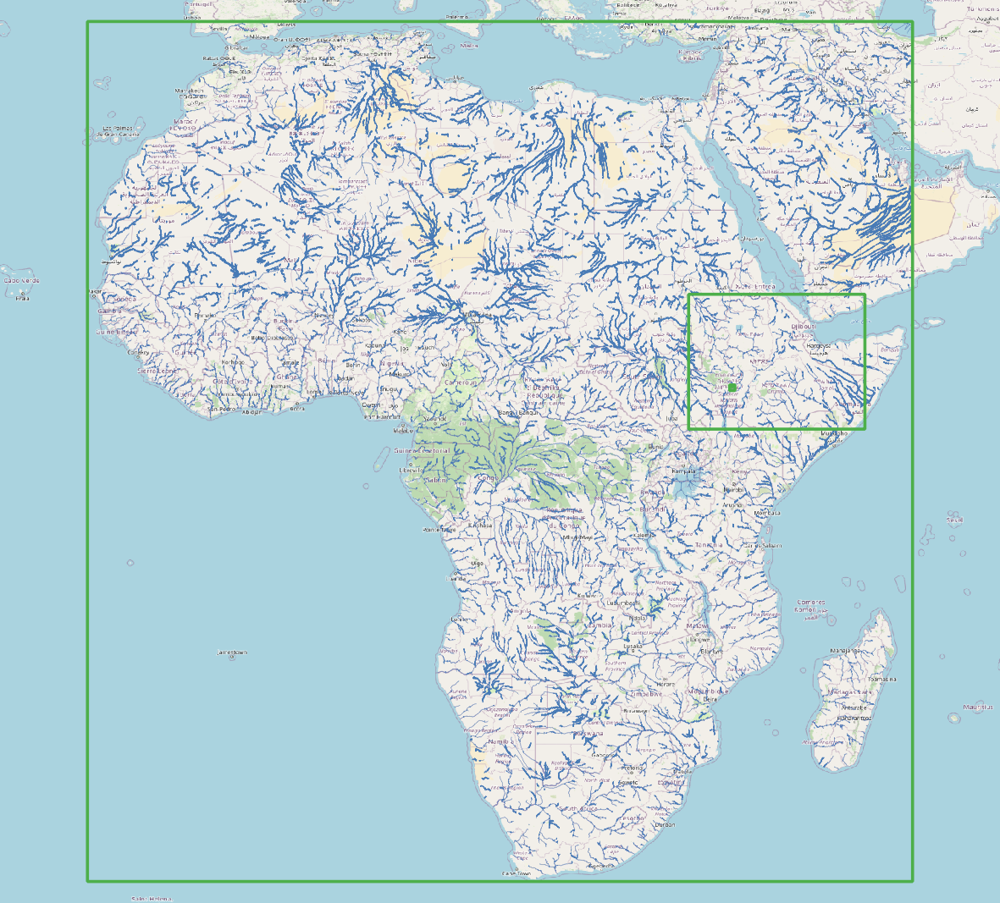
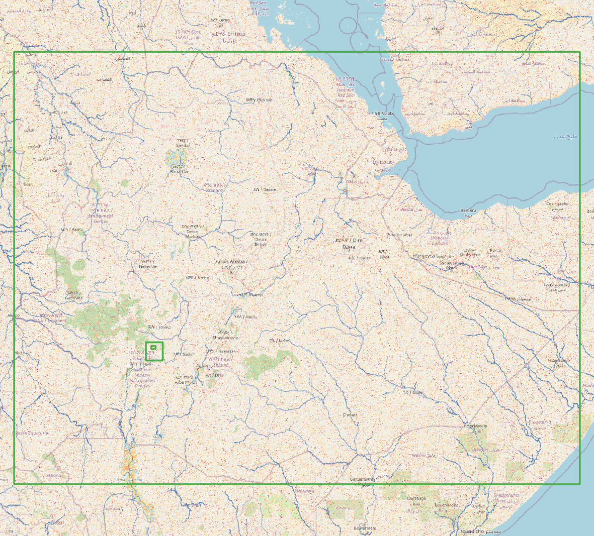
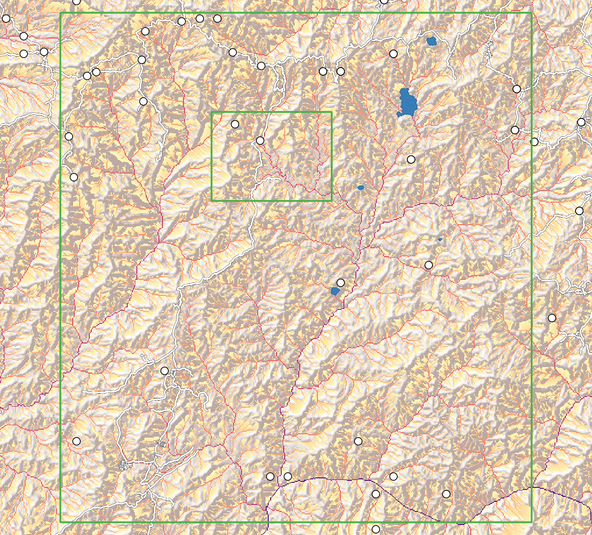
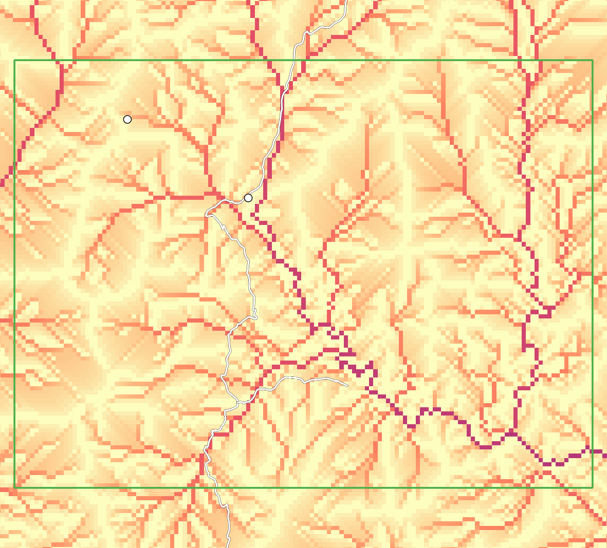
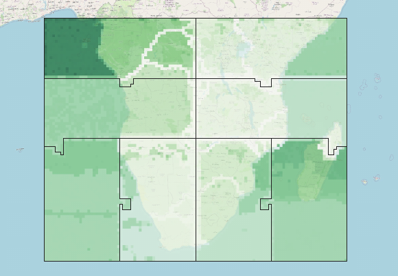

# MERIT Hydro dataset
In all experiments, we used the [MERIT Hydro
dataset](https://hydro.iis.u-tokyo.ac.jp/~yamadai/MERIT_Hydro/) for the African continent. This
dataset has a 3 arc-second resolution, which corresponds to almost 90 m resolution at the
equator. It contains 87.600 x 84.000 raster cells and represents a realistic high resolution
dataset that can be used in global and continental scale modelling studies.

These figures show the detail of the dataset by zooming into the green boxes shown. (Base map
and data from OpenStreetMap and OpenStreetMap Foundation.)

# Timestamp
We performed our experiments on flow direction arrays with few no-data cells. In case of load
imbalance due to large areas of the flow direction array being filled with no-data values,
our algorithm is not able to provide all CPU cores with tasks at all times. This can be
illustrated by keeping track of when for each partition the flow accumulation calculations
finish. Processes for which all partitions have finished calculations will be drained of work
while other processes are still processing tasks. Solving this imbalance would require the
migration of array partitions between processes, which we have not implemented and tested yet.

For each partition the relative moment in time at which point a run of the `accu_threshold`
operation for the southern half of the African continent finished its calculations. Darker
partitions finished before lighter ones. The differences are determined by the algorithm (results
for downstream cells depend on results from upstream cells), but also by the domain partitioning,
distribution of partitions over processes, and the order with which the scheduler selects tasks
for execution. Partitions are assigned to different processes (outlined). (Base map and data
from OpenStreetMap and OpenStreetMap Foundation.)

# Runoff
Output of the flow accumulation operation for the whole of Africa at 3 arc-second resolution.

